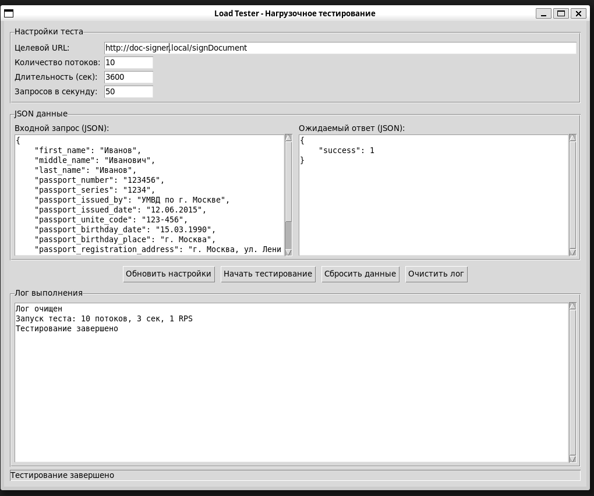

# Load Tester ver 1.1.0 - Утилита нагрузочного тестирования

### Описание

Load Tester - это высокопроизводительная утилита для нагрузочного тестирования HTTP API, построенная на гибридной архитектуре C++/Python.

### Архитектура

1. Ядро на C++ (libload_tester.so)
- Нативный код C++ обеспечивает максимальную скорость выполнения HTTP-запросов
- Использует std::thread для параллельной отправки запросов
- Минимизация накладных расходов
- Интеграция с CURL для сетевых операций

2. C-интерфейс (load_tester_c.h/cpp)
- Обеспечивает взаимодействие между C++ и Python через C ABI
- C ABI гарантирует совместимость между разными версиями компиляторов
- Инкапсуляция C++ объектов через opaque pointers

3. Графический интерфейс на Python (load_tester_gui.py)
- Работает на Windows, Linux, macOS
- Интуитивный интерфейс
- Легкая модификация и расширение функциональности
- Использует ctypes для вызова C-функций

### Взаимодейсвтие компонентов

```text
Python GUI (Tkinter)
        ↓
    ctypes bridge
        ↓
C Interface (load_tester_c)
        ↓
C++ Core (LoadTester)
        ↓
HTTP Requests (libcurl)
```
### Текущее ограничение
#### Вывод информации тестирования
В настоящее время вся информация о ходе тестирования выводится в стандартный поток вывода (консоль) вместо графического интерфейса.
Это означает, что при запуске теста:
- Прогресс-бар (Progress: X% | Requests: Y | Success: Z | Errors: W)
- Информация о successful запросах
- Детали ошибок и HTTP-статусы
Финальная статистика тестирования отображаются только в терминале/консоли, а не в окне "Лог выполнения" графического интерфейса.

#### Планируемые улучшения
Для полной интеграции вывода необходимо реализовать:
- Callback механизм из C++ в Python
- Перенаправление std::cout в GUI-лог
- Очередь сообщений между потоками C++ и Python
- Безопасную передачу данных между нативным кодом и интерпретатором

### Сборка динамической библиотеки

#### Компиляция C++ библиотеки
```bash
g++ -std=c++17 -fPIC -O2 -c load_tester.cpp -o load_tester.o
g++ -std=c++17 -fPIC -O2 -c load_tester_c.cpp -o load_tester_c.o
```

#### Создание shared library
```bash
g++ -shared -o libload_tester.so load_tester.o load_tester_c.o -lcurl -ljsoncpp -lpthread
```
---
### Документация по графическому интерфейсу 



#### 1. Краткий обзор

Графический интерфейс Load Tester предоставляет удобный способ настройки и запуска нагрузочного тестирования HTTP API через интуитивно понятный интерфейс без необходимости редактирования кода.
#### 2. Быстрый старт
##### Требования
- Python 3.6+
- Библиотека `libload_tester.so` (скомпилированная из C++ кода)
- Tkinter
##### Запуск графического интерфейса
```bash
python3 load_tester_gui.py
```
#### 3. Описание интерфейса

#### 3.1 Секция "Настройки теста"

**Целевой URL**
- Введите полный URL API эндпоинта для тестирования
- Пример: `https://api.example.com/v1/endpoint`    

**Количество потоков**
- Число параллельных потоков для отправки запросов
- Рекомендуется: 10-50 потоков

**Длительность (сек)**
- Продолжительность теста в секундах
- Рекомендуется: 30-3600 секунд

**Запросов в секунду (RPS)**
- Целевое количество запросов в секунду
- 0 = максимальная скорость
- Рекомендуется: 50-1000 RPS
#### 3.2 Секция "JSON данные"

 Левая панель: "Входной запрос (JSON)"
- JSON структура, которая будет отправляться на сервер
- Поддерживает автоматическую генерацию случайных значений

Пример:
```json
{
    "username": "test_user",
    "password": "test_pass",
    "user_id": "random",
    "action": "login"
}
```

Правая панель: "Ожидаемый ответ (JSON)"
- JSON структура, которую вы ожидаете от сервера
- Используется для проверки корректности ответов

Пример:
```json
{
    "success": true,
    "status": "ok",
    "error": null
}
```

#### 3.3 Кнопки управления

 **Обновить настройки**
- Применяет изменения в JSON полях и настройках теста
- **Обязательно нажимайте перед запуском теста!**

**Начать тестирование**
- Запускает нагрузочный тест с текущими настройками
- Кнопки блокируются на время выполнения теста

**Сбросить данные**
- Возвращает все поля к значениям по умолчанию
- Очищает JSON поля

**Очистить лог**
- Очищает окно лога выполнения
#### 3.4 Мониторинг

**Лог выполнения**
- Отображает прогресс тестирования в реальном времени
- Показывает статистику: выполненные запросы, успешные/ошибочные ответы
- Выводит детальную информацию об ошибках

#### 4. Особенности использования

#### 4.1 Генерация случайных значений

В поле "Входной запрос" вы можете указать специальные значения для автоматической генерации:
```json
{
    "user_id": "random",     // Случайное число 1000-9999
    "session_id": "",        // Пустая строка = случайное число
    "timestamp": "rand"      // Альтернативные ключевые слова
}
```

#### 4.2 Настройка проверки ответов

Система автоматически проверяет все поля из "Ожидаемый ответ":
- **Присутствие полей** - проверяет что указанные поля существуют в ответе
- **Значения полей** - сравнивает фактические значения с ожидаемыми
- **Гибкая настройка** - можно проверять только наличие полей или конкретные значения

